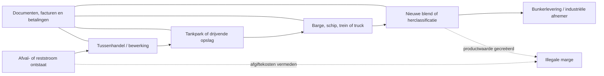

# OSINT-dossier: stookolie, afvalbijmenging en ketenfraude

**Peildatum:** 16 juli 2026  
**Doel:** een defensieve, uitsluitend op openbare bronnen gebaseerde inventarisatie van (1) bekende handelswijzen, (2) detecteerbare indicatoren en (3) aantoonbaar bruikbare interventies.  
**Afbakening:** dit dossier noemt geen niet-veroordeelde personen of bedrijven en bevat geen mengrecepten, verhoudingen of instructies waarmee fraude kan worden uitgevoerd.

**Praktische vervolgstap:** gebruik het invulbare [360°-OSINT-werkboek](./360-graden-OSINT-werkboek.md) om een historische of actuele signaalanalyse gestructureerd uit te voeren.

**Internationale vergelijking:** de [vergelijkende casusmatrix](./vergelijkende-internationale-casusmatrix.md) legt zeven zaken en operaties uit Nederland, Europa, Singapore, het Verenigd Koninkrijk en mondiale samenwerking langs dezelfde analysekaders.

**Ketenverdieping:** het [debunkering-risicodossier Rotterdam/ARA–Singapore](./debunkering-risicodossier-ARA-Singapore.md) analyseert het moment waarop afgekeurde brandstof product kan blijven of een gereguleerde afvalstroom wordt.

## Kernbeeld

De fraude moet niet worden gezien als één handeling — “afval in stookolie mengen” — maar als een combinatie van goederenfraude, afvalcriminaliteit, documentfraude en vaak fiscale of financiële criminaliteit. De fysieke vloeistof beweegt door een keten van producent, handelaar, tankterminal, blender, vervoerder, bunkerleverancier en eindgebruiker. Eigendom, feitelijke bewaring en documentatie kunnen daarbij op verschillende momenten bij verschillende partijen liggen.

INTERPOL beschrijft illegale olieblending expliciet als het mengen van brandstof met andere stoffen om volume en winst te vergroten. De organisatie karakteriseert pollution crime als een internationaal **high-reward/low-risk** verdienmodel dat legale en illegale activiteiten vermengt. Europol-operaties tonen daarnaast misbruik van afvalcodes, juridische mazen, valse documenten en fiscale constructies. Dat ondersteunt de werkhypothese dat betrouwbare detectie drie sporen tegelijk nodig heeft: **stof, stroom en geld**.

## Stap 1 — Bekende modi operandi

### 1. Bijmengen van afval- of reststromen in een commerciële brandstofstroom

Een afvalstof of problematische reststroom wordt als blendcomponent gebruikt, waarna het mengsel als brandstof of olieproduct wordt verkocht. De dubbele winstprikkel is het vermijden van verwerkingskosten én het creëren van verkoopbaar volume. De juridische kernvraag is vaak niet alleen wat de stof chemisch is, maar ook of zij de afvalstatus ooit rechtmatig heeft verloren.

**Ketenmomenten:** productielocatie, afvalinzamelaar, shore tank, floating storage, bunkerbarge of vóór overdracht aan de eindgebruiker.

### 2. Verdunnen, samenvoegen of “wegmengen” van een probleempartij

Een afgekeurde, vervuilde of niet-bruikbare partij wordt niet als afval afgevoerd, maar in grotere partijen verdund of over meerdere tanks/leveringen verdeeld. Een Nederlands arrest over niet-bruikbare bunkerolie laat zien dat operationele problemen, een afwijkend analyseresultaat en een onjuiste waarde op de Bunker Delivery Note gezamenlijk relevant bewijs kunnen vormen.

### 3. Product-afval-misclassificatie

Een afvalstof wordt administratief omschreven als product, grondstof, bijproduct, “off-spec” handelswaar of een onjuiste afvalcode. In grensoverschrijdende zaken kan daardoor de vereiste kennisgeving of toestemming worden omzeild. Europols operatie Custos Viridis noemt documentfraude, misbruik van juridische mazen en niet-naleving van afvalcodes als terugkerende werkwijzen.

### 4. Documenten laten afwijken van de fysieke werkelijkheid

Voorbeelden op hoofdlijnen zijn onjuiste hoeveelheden of kwaliteit op de Bunker Delivery Note, valse analyserapporten/certificaten, vervalste facturen, onjuiste herkomst of bestemming en fictieve transportbewegingen. Operation Sturm Oil combineerde gemanipuleerde brandstof met valse facturen, schijnbestemmingen en vervalste vervoersdocumenten.

### 5. Ketens van wisselende tussenbedrijven en stromannen

Meerdere kortlevende of economisch dunne rechtspersonen kunnen eigendomsoverdrachten, facturen en aansprakelijkheid versnipperen. FATF constateert bij milieucriminaliteit het gebruik van frontbedrijven, offshore-structuren, trade-based fraud en het vroeg vermengen van legale en illegale goederen en geldstromen.

### 6. Fiscale “designer fuel”-fraude

Een mengsel wordt zo gepresenteerd dat het administratief in een lager of vrijgesteld belastingregime lijkt te vallen, terwijl het feitelijk als motor- of andere belaste brandstof wordt gebruikt. Europol documenteerde zowel “designer fuel” als diesel waaraan additieven werden toegevoegd om aard en bestemming te verhullen. Dit overlapt met afvalfraude, maar is niet automatisch hetzelfde delict.

### 7. Omleiding tijdens vervoer of overslag

Een opgegeven bestemming wordt niet bereikt; de lading wordt tussentijds opgeslagen, overgeslagen of elders verkocht. Transportmodaliteiten kunnen achtereenvolgens worden gebruikt, waardoor volumes en partij-identiteit moeilijker te volgen zijn. In bekende brandstoffraudezaken komen begeleidingsvoertuigen en pogingen om tracking te verstoren voor.

### 8. Misbruik van legitieme infrastructuur

De terminal, vervoerder of afnemer hoeft niet noodzakelijk op de hoogte te zijn. INTERPOL benadrukt dat pollution crime vaak naast legitieme bedrijfsvoering bestaat. Onderzoek moet daarom rollen scheiden: eigenaar, ontdoener, feitelijk houder, vervoerder, monsternemer, documentopsteller en uiteindelijk begunstigde.

### 9. Afkeur, debunkering en retourstromen als kwetsbaar moment

Wanneer geleverde bunkerolie wordt afgekeurd of teruggepompt, ontstaat een nieuwe stroom waarvan status, hoeveelheid en bestemming opnieuw moeten worden vastgesteld. De ILT noemt een debunkerverzoek een indicatie dat de levering mogelijk niet overeenkwam met de Bunker Delivery Note. Dit is een onderzoeksindicator, geen bewijs van fraude.

## Stap 2 — Detectie- en risico-indicatoren

Geen losse indicator bewijst fraude. De sterkste signalen ontstaan wanneer onafhankelijke gegevens uit meerdere kolommen niet met elkaar te verenigen zijn.

| Spoor | Openbaar of rechtmatig beschikbaar signaal | Mogelijke onschuldige verklaring | Verificatievraag |
|---|---|---|---|
| Stof | Onverwachte contaminanten, sediment, metalen, halogenen of afwijkende fysische eigenschappen | Procesvariatie of legitieme blendcomponent | Past de volledige samenstelling bij opgegeven feedstocks en toepassing? |
| Stof | Analyse vóór overdracht wijkt af van analyse na overdracht | Monstername-, homogeniteits- of laboratoriumverschil | Waren monsters representatief, verzegeld en aantoonbaar uit dezelfde partij? |
| Stof | Terugkerende filter-, separator- of motorproblemen na levering | Technisch defect of incompatibele maar legale brandstoffen | Corresponderen logboek, monsters, BDN en tankhistorie? |
| Stroom | Ingaand en uitgaand volume/massa is niet sluitend | Meetonzekerheid, temperatuurcorrectie of normale verliezen | Is een reproduceerbare massabalans per tank en periode mogelijk? |
| Stroom | Veel kleine transfers, tankwisselingen of ongebruikelijke tussenstops | Operationele planning | Hebben transfers een aantoonbare commerciële en logistieke reden? |
| Stroom | Opgegeven bestemming strookt niet met feitelijke route of ontvangst | Omleiding door planning/noodzaak | Bestaan ontvangstbewijs, terminalrecord en corresponderende betaling? |
| Status | Dezelfde stroom heet achtereenvolgens afval, bijproduct en product | Rechtmatige verwerking of end-of-waste-besluit | Welke concrete behandeling en juridische grond beëindigde de afvalstatus? |
| Document | BDN, certificaat, factuur, douaneaangifte en tanklog verschillen | Administratieve fout of verschillende meetmomenten | Welke primaire registratie ontstond het eerst en wie wijzigde wat? |
| Organisatie | Snelle reeks handelaren zonder zichtbare capaciteit of toegevoegde waarde | Normale commodity trading | Wie droeg prijs-, kwaliteits- en voorraadrisico en wie profiteerde uiteindelijk? |
| Geld | Prijs onder markt én vergoeding voor ontvangst van dezelfde stroom | Kwaliteitskorting of dienstverleningscomponent | Worden afvalacceptatie en productverkoop economisch dubbel geboekt? |
| Geld | Factuurstromen staan niet in verhouding tot fysieke volumes | Vooruitbetaling, hedging of verrekening | Is iedere betaling aan een concrete partij, levering en contractprestatie te koppelen? |
| Handhaving | Herhaalde afkeur, debunkering, vergunningwijzigingen of sancties rond dezelfde knooppunten | Complexe operatie met verhoogde inspectiedruk | Is er een terugkerend patroon over partijen, bestuurders, tanks en routes? |

### OSINT-datamodel voor een concrete casus

Leg per gebeurtenis minimaal vast:

- datum/tijd en bron;
- stof- of productomschrijving, afvalcode en opgegeven kwaliteit;
- volume én, waar mogelijk, massa en dichtheid;
- batch-, tank-, vervoers- en documentnummer;
- verzender, eigenaar, feitelijk houder, vervoerder, ontvanger en ultimate beneficial owner voor zover openbaar;
- laad-, overslag- en loslocaties;
- factuurwaarde, valuta en opgegeven dienst;
- monsterlocatie, methode, verzegeling, laboratorium en analysemoment;
- feit, verklaring, hypothese en onzekerheid als afzonderlijke velden.

Een praktisch analysekader is vervolgens:

1. **Massabalans:** kan materie verdwijnen of ontstaan zonder gedocumenteerde verklaring?
2. **Tijdbalans:** konden schip, trein of truck fysiek op het genoemde moment op de genoemde plaats zijn?
3. **Documentbalans:** beschrijven onafhankelijke documenten dezelfde partij, kwaliteit en bestemming?
4. **Geldbalans:** volgt de betalingsstroom de goederenstroom en is de marge economisch verklaarbaar?
5. **Statusbalans:** is iedere overgang van afval naar product juridisch en technisch aantoonbaar?

## Stap 3 — Aanpakken met aantoonbare waarde

### A. Intelligence-led, gelijktijdige controles over grenzen en instanties

Operation 30 Days at Sea 3.0 begon met vijf maanden informatieverzameling en analyse, gevolgd door gecoördineerde controles. Volgens Europol/INTERPOL voerden 300 instanties uit 67 landen circa 34.000 controles uit en ontdekten zij 1.600 overtredingen, waaronder 130 gevallen van afvaltransport via havens. Custos Viridis (operationele periode 2025) gebruikte eveneens een intelligencefase en multidisciplinaire teams; Europol rapporteerde 1.048 inspecties, 337 arrestaties, 127.149 ton onderschept afval en bijna €10 miljoen aan cash en banktegoeden.

**Waarom bruikbaar:** netwerken kunnen een lokaal toezichtgat benutten; simultane acties verkleinen de kans dat administratie, voorraad of geld wordt verplaatst.  
**Bewijskracht:** sterke operationele output, maar openbare cijfers bewijzen niet hoeveel criminaliteit duurzaam is voorkomen.

### B. Een ononderbroken chain of custody met representatieve monsters

IMO-regels koppelen de BDN aan een representatief, verzegeld en ondertekend monster. IMO-best practice adviseert bovendien bemonstering en documentatie bij iedere custody transfer in de keten. Singapore past ketenbrede kwaliteitsstandaarden, verplichte licenties/accreditatie en custody-transfer sampling toe.

**Waarom bruikbaar:** een goed monster koppelt chemie aan een exact overdrachtsmoment en beperkt discussie over waar contaminatie ontstond.  
**Randvoorwaarde:** steekmonsters zonder goede locatie, representativiteit, verzegeling en bewaarketen hebben beperkte bewijswaarde.

### C. Risicogestuurde upstream-tests, niet alleen testen bij het eindschip

Na een contaminatie-incident rapporteerde Singapore gemiddeld meer dan 1.300 jaarlijkse monsters binnen zijn kwaliteitsprogramma’s en voegde het gerichte chemische parameters toe. Sinds juni 2024 moeten bepaalde aanvullende tests na eventuele blending in shore/floating tanks en vóór bunkerlevering worden uitgevoerd.

**Waarom bruikbaar:** upstream-controle kan een hele besmette batch stoppen voordat deze over vele leveringen wordt verspreid.  
**Beperking:** geen vaste analysetabel detecteert iedere onbekende stof; non-target screening en context blijven nodig.

### D. Koppel milieuonderzoek direct aan financiële en fiscale analyse

FATF beschrijft een Italiaanse casus waarin een belastingcontrole onregelmatigheden in afvalherkomst, begeleidingsdocumenten en facturen blootlegde. Analyse van 90 meldingen van ongebruikelijke transacties en één buitenlandse FIU-melding hielp 44 bedrijven te identificeren; de zaak leidde volgens FATF tot 14 arrestaties en beslag ter waarde van USD 9,5 miljoen.

**Waarom bruikbaar:** afval- en brandstofmarges laten vaak financiële sporen na die langer bestaan dan de fysieke partij. Vermogensbeslag verandert bovendien de kosten-batenverhouding voor daders.

### E. Vergunningen, registratie en ketenverantwoordelijkheid combineren

IMO verlangt lokaal toezicht op bunkerleveranciers, registratie, bewaarplicht van BDN’s en optreden tegen leveranciers die niet-conforme brandstof leveren. Singapore koppelt markttoegang aan licentie en blijvende accreditatie; SS 524 richt zich op een ononderbroken kwaliteitscontrole door de hele keten.

**Waarom bruikbaar:** toezicht krijgt een aangrijpingspunt vóór een strafzaak en kan structurele tekortkomingen corrigeren of markttoegang beperken.

### F. Gemeenschappelijke inspectieplannen en gegevensdeling

De EU-Verordening 2024/1157 vereist mechanismen voor samenwerking tussen relevante handhavingsinstanties en voorziet in een enforcement group voor trends, intelligence, risicoanalyses en best practices. Het Verdrag van Bazel biedt gezamenlijke richtlijnen voor douane, havens, milieu-inspecties, politie, aanklagers en rechters.

**Waarom bruikbaar:** een partij kan tegelijk onder goederen-, afval-, douane-, accijns-, scheepvaart- en strafrecht vallen. Geïsoleerde datasets missen juist de inconsistenties die fraude zichtbaar maken.

### G. Sanctioneer de rechtspersoon en neem het voordeel af

UNODC waarschuwt dat lage boetes onderdeel van de bedrijfskosten kunnen worden. Effectieve maatregelen moeten daarom rekening houden met winst, detectiekans en financiële draagkracht en waar passend ook rechtspersonen, bestuurders en wederrechtelijk voordeel raken.

## Prioriteiten voor een Nederlands OSINT-project

1. **Bouw eerst een neutrale ketenkaart**, niet een lijst “verdachten”. Breng rollen, terminals, transportmodaliteiten, vergunninghouders en overdrachtsmomenten in beeld.
2. **Selecteer één afgebakende stroom of incidenttype**, bijvoorbeeld debunkering/retourpartijen, in plaats van de gehele wereldmarkt tegelijk.
3. **Maak een event-ledger** waarin stof, stroom, documenten en geld aan dezelfde tijdlijn worden gekoppeld.
4. **Gebruik openbare bedrijfsregisters, vergunningen, rechterlijke uitspraken, inspectierapporten, scheepsbewegingen en aanbestedings-/handelsinformatie**, maar documenteer licentie, herkomst en tijdstip van iedere bron.
5. **Werk met hypotheses die weerlegbaar zijn.** Bijvoorbeeld: “partij X veranderde tussen A en B van status zonder zichtbare behandeling.” Zoek daarna ook actief naar een legale verklaring.
6. **Draag concrete bevindingen besloten over aan de bevoegde instantie.** Publiceer geen persoonsgegevens, beschuldigingen, precieze kwetsbaarheden of operationele observaties die toezicht kunnen doorkruisen.

## Wat OSINT wel en niet kan bewijzen

OSINT kan inconsistenties, netwerken, eigendomsrelaties, routes, terugkerende knooppunten en economisch onwaarschijnlijke patronen aantonen. OSINT kan doorgaans niet zelfstandig bewijzen wat zich in een gesloten tank bevond, wie opzet had, of een monster representatief was. Daarvoor zijn bevoegd verkregen administratie, forensische monstername, verhoren en financiële gegevens nodig. De juiste uitkomst van burgeronderzoek is daarom meestal een **controleerbare signaalrapportage**, geen publieke schuldconclusie.

## Bronnen (selectie, primair/institutioneel)

- [INTERPOL — Pollution crime](https://www.interpol.int/en/Crimes/Environmental-crime/Pollution-crime)
- [INTERPOL — The Nexus between Organized Crime and Pollution Crime](https://www.interpol.int/en/content/download/17946/file/INTERPOL%20Report%20OC-PC_Final.pdf?inLanguage=eng-GB&version=3)
- [Europol — Operation Custos Viridis (2026)](https://www.europol.europa.eu/media-press/newsroom/news/europol-leads-international-operation-against-environmental-crime-and-waste-trafficking)
- [Europol — 30 Days at Sea 3.0, operationele resultaten](https://www.europol.europa.eu/media-press/newsroom/news/1-600-offences-detected-in-global-operation-against-marine-pollution)
- [Europol — Operation Sturm Oil](https://www.europol.europa.eu/media-press/newsroom/news/millions-of-euros-recovered-in-operation-against-excise-fraud)
- [Europol — designer-fueloperatie](https://www.europol.europa.eu/media-press/newsroom/news/blow-to-fuel-fraudsters-59-arrests-in-europe)
- [FATF — Money Laundering from Environmental Crime](https://www.fatf-gafi.org/en/publications/Environmentalcrime/Money-laundering-from-environmental-crime.html)
- [IMO — Fuel oil quality, Regulation 18](https://www.imo.org/en/ourwork/environment/pages/fuel-oil-quality-%E2%80%93-regulation-18.aspx)
- [IMO — Best practice for fuel-oil suppliers](https://wwwcdn.imo.org/localresources/en/OurWork/Environment/Documents/MEPC.1-Circ.875-Add.1.pdf)
- [Basel Convention — guidance on illegal traffic](https://www.basel.int/Implementation/LegalMatters/IllegalTraffic/Guidance/tabid/3423/Default.aspx)
- [EU — Verordening (EU) 2024/1157 betreffende overbrenging van afvalstoffen](https://eur-lex.europa.eu/legal-content/EN/TXT/?uri=CELEX:32024R1157)
- [UNODC — Combating Pollution Crime: Guide to Good Legislative Practices](https://www.unodc.org/cld/uploads/pdf/Combating_Pollution_Crime_-_A_Guide_to_Good_Legislative_Practices_English.pdf)
- [ILT — Stookolie voor zeeschepen en autobrandstoffen voor West-Afrika](https://www.ilent.nl/binaries/ilt/documenten/leefomgeving-en-wonen/stoffen-en-producten/chemische-stoffen-en-mengsels/rapporten/stookolie-voor-zeeschepen-en-autobrandstoffen-voor-west-afrika/Stookolie%2Bvoor%2Bzeeschepen%2Ben%2Bautobrandstoffen%2Bvoor%2BWest-Afrika.pdf)
- [ILT — Debunkering of rejected marine fuel oil](https://english.ilent.nl/topics/shipping/fuel-for-seagoing-vessels/debunkering)
- [Rechtspraak — ECLI:NL:GHDHA:2018:3444](https://uitspraken.rechtspraak.nl/details?id=ECLI:NL:GHDHA:2018:3444)
- [MPA Singapore — Bunkering standards](https://www.mpa.gov.sg/port-marine-ops/marine-services/bunkering/bunkering-standards)
- [MPA Singapore — Quality assurance measures after contamination incident](https://www.mpa.gov.sg/docs/mpalibraries/media-releases/2022/annex-b_5-may-2022.pdf)
- [MPA Singapore — Enhanced testing from 2024](https://www.mpa.gov.sg/api/media/a17d0414-f606-4714-9cb9-cd745724f632/pc24-03a17d0414f60647149cb9cd745724f632.pdf)

## Betrouwbaarheid en beperkingen

- De bronnen zijn overwegend verdragsorganisaties, toezichthouders, politieorganisaties, wetgeving en rechtspraak.
- Operationele persberichten geven uitkomsten, maar zelden controlegroepen of langetermijneffecten. “Succesvol” betekent hier daarom: aantoonbare detectie, verstoring, arrestaties/beslag of structurele kwaliteitsborging — niet automatisch bewezen duurzame preventie.
- De beschreven modi operandi zijn wereldwijd gemeld, maar prevalentie per land en haven kan op basis van deze openbare selectie niet betrouwbaar worden gerangschikt.
- Regels, normen en implementatiedata kunnen wijzigen; controleer bij operationeel gebruik altijd de actuele officiële tekst.
