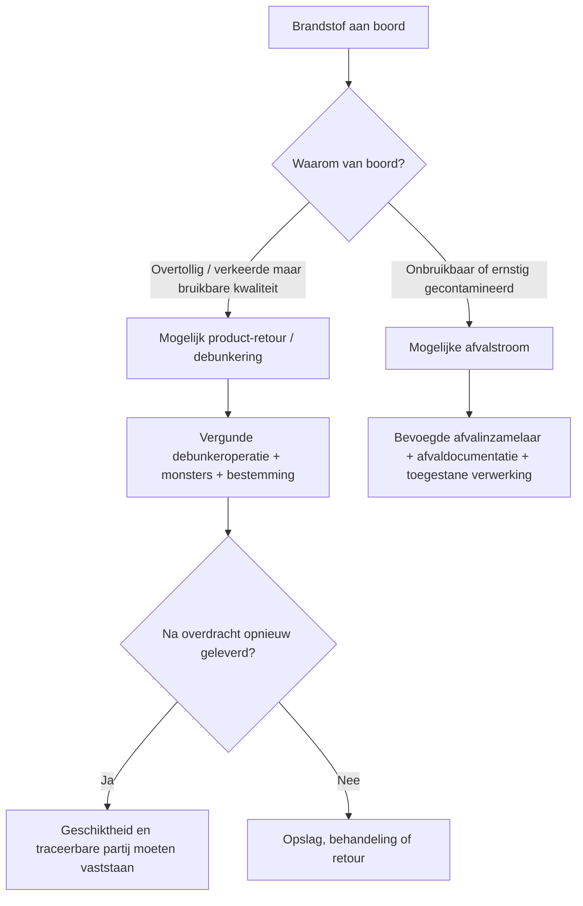

# Debunkering-risicodossier: Rotterdam/ARA en Singapore

**Peildatum:** 16 juli 2026  
**Doel:** vergelijken hoe afgekeurde, overtollige of verkeerd geleverde scheepsbrandstof uit een zeeschip wordt verwijderd, wanneer die stroom mogelijk afval is en waar toezichtblinde vlekken kunnen ontstaan.  
**Afbakening:** openbare regels en formulieren; geen beoordeling van individuele bedrijven of actuele transacties.

## 1. Kernconclusie

Debunkering is geen gewone omgekeerde bunkerlevering. Het is een **statuspoort**:

Rotterdam maakt dit onderscheid in de openbare toelichting expliciet: alleen brandstof die geschikt blijft voor gebruik valt onder debunkering; wanneer de brandstof ongeschikt is en niet door eenvoudige bewerking opnieuw als brandstof kan worden gebruikt, moet zij als afval naar een vergunde inzamelaar. Singapore vraagt in het aanvraagformulier rechtstreeks of de brandstof off-spec is, met chemicaliën/afval is gecontamineerd, opnieuw als bunker zal worden geleverd of wordt verwijderd.

De grootste analytische kwetsbaarheid zit niet in de slang, maar in de **beslissing vóór de slang wordt aangesloten**: wie bepaalt op basis van welke monsters dat de stroom nog product is?

## 2. Begrippen die niet door elkaar mogen lopen

| Begrip | Werkdefinitie voor dit dossier | Belangrijk onderscheid |
|---|---|---|
| Off-spec | Voldoet niet aan één of meer overeengekomen/vereiste specificaties | Niet iedere off-spec brandstof is automatisch afval |
| Verkeerde grade | Op zichzelf bruikbare brandstof, maar niet geschikt/gewenst voor dit schip of deze inzet | Kan product blijven |
| Overtollige bunker | Meer brandstof dan operationeel nodig | Kan product blijven |
| Gecontamineerde brandstof | Bevat ongewenste stoffen | Ernst, herkomst, herstelbaarheid en gebruiksveiligheid bepalen vervolgstap |
| Debunkering | Brandstof uit bunkertank van schip verwijderen terwijl zij geschikt blijft voor gebruik, volgens Rotterdamse toelichting | Geen etiket om afvalstatus te vermijden |
| Scheepsafvalstof | Stroom waarvan houder zich ontdoet/wil of moet ontdoen en waarop afvalregels van toepassing zijn | Commerciële waarde sluit afvalstatus niet uit |
| End-of-waste/hernieuwd product | Afval dat na rechtmatige behandeling en toetsing niet langer afval is | Alleen voorgenomen blending of toekomstige verkoop is onvoldoende |

## 3. Rotterdam: openbaar procesbeeld

### 3.1 Voorafgaande aanvraag en betrokken autoriteiten

Het Rotterdamse aanvraagformulier verzamelt onder meer:

- aanvrager en namens wie wordt aangevraagd;
- zeeschip, IMO-nummer, eigenaar/charteraar, vorige en volgende haven;
- ontvangend bedrijf en bunkerschip;
- ligplaats en geplande duur;
- ISO 8217-brandstoftype en grade;
- hoeveelheid als volume bij actuele temperatuur, Gross Standard Volume en metrische tonnen;
- herkomst, leverancier en bestemming;
- reden van debunkering;
- analyserapport en Bunker Delivery Note.

De pdf vermeldt dat ILT, Douane en Zeehavenpolitie worden geïnformeerd. Het havenbedrijf kan bezwaar, geen bezwaar of voorwaarden registreren. De agent van het zeeschip — niet de ontvanger — moet volgens de bunkerlicentietoelichting het formulier invullen.

**Sterk punt:** de partij wordt vóór overdracht gekoppeld aan schip, ontvanger, hoeveelheid, herkomst, bestemming en primaire kwaliteitsdocumenten.

### 3.2 Vergunning en melding

Voor residuale brandstoffen, distillaten en biodiesel geldt in Rotterdam een bunker-/debunkervergunning. Activiteiten worden vooraf gemeld; bij debunkering worden begin en verwacht einde aan het Harbour Coordination Centre gemeld. De openbare licentietoelichting vermeldt dat deze melding niet via de reguliere Portbase Bunkers Notification loopt maar via het HCC.

**Analytisch aandachtspunt:** wanneer bunkerlevering en debunkering in verschillende registratiesystemen of meldstromen staan, moet een retourpartij expliciet aan de oorspronkelijke levering worden gekoppeld.

### 3.3 Monstername en bewaartermijn

De Rotterdamse bunkerlicentie 2024 vereist vóór de debunkering één of meer gelabelde monsters uit de bunkertank(s) die worden leeggehaald. Tijdens de debunkering wordt volgens de reguliere bemonsteringsprocedure een composite sample genomen, gelabeld en geregistreerd. Dit monster moet minstens zes maanden aan boord van het bunkerschip of in een daarvoor ingerichte walopslag worden bewaard. Het aanvraagformulier en de checklist moeten beschikbaar zijn op zowel het afgevende zeeschip als het ontvangende bunkerschip.

**Sterk punt:** tankmonster vóór overdracht én samengesteld overdrachtsmonster maken vergelijking mogelijk.  
**Openbare onzekerheid:** uit de geraadpleegde documenten blijkt niet dat iedere debunkerpartij standaard met uitgebreide non-target screening wordt geanalyseerd.

### 3.4 De product/afvalbeslissing

De toelichting stelt:

- debunkering betreft brandstof die geschikt blijft voor gebruik;
- als de brandstof ongeschikt is en niet via eenvoudige verwerking opnieuw als brandstof kan worden gebruikt, is sprake van een afvalstroom;
- die stroom moet aan een vergunde afvalinzamelaar worden afgegeven;
- het debunkerformulier helpt bepalen of mogelijk sprake is van afval.

Dit is het kritieke juridische knooppunt. De reden “verkeerde brandstof voor dit schip” kan legitiem product-retour betekenen. “Onbekende contaminatie en operationele schade” vraagt een veel zwaardere onderbouwing voordat dezelfde stroom opnieuw als product wordt behandeld.

### 3.5 Kwantiteitscontrole

Sinds 1 januari 2026 is voor levering van residuale brandstoffen, distillaten en biofuels in Rotterdam en Antwerpen-Brugge een geregistreerde Mass Flow Meter verplicht. Dit verbetert de leveringshoeveelheid en maakt de bunkerketen transparanter.

**Beperking:** een MFM zegt hoeveel massa passeert, niet of de stof legaal product, afval of gecontamineerd is. Voor debunkering blijft een koppeling nodig tussen tankmeting, composite sample, aanvraag en bestemming.

## 4. Antwerpen-Brugge: openbaar procesbeeld

Port of Antwerp-Bruges publiceert dat conventionele brandstoffen via vergunde bunkeroperatoren worden geleverd en dat sinds 1 januari 2026 dezelfde MFM-verplichting als in Rotterdam geldt. Overtredingen kunnen tot boetes of intrekking van de bunkerlicentie leiden.

In de geraadpleegde openbare webbronnen is geen even gedetailleerd, centraal debunkerformulier gevonden als voor Rotterdam en Singapore. Dat betekent niet dat zulke regels of operationele procedures niet bestaan; alleen dat ze in deze OSINT-ronde niet publiek even zichtbaar waren.

**OSINT-les:** vergelijkbaarheid binnen ARA mag niet worden verondersteld op basis van de gezamenlijke MFM-regel. MFM harmoniseert kwantiteitsmeting, niet automatisch afvalstatus, monsterbewaring, aanvraagvelden of retourtraceerbaarheid.

## 5. Singapore: openbaar procesbeeld

### 5.1 Uitdrukkelijke toestemming

Debunkering in de haven mag alleen met uitdrukkelijke toestemming van de Port Master. Regulation 44 verbiedt ship-to-ship transfer van bulk liquids zonder schriftelijke toestemming en opgelegde voorwaarden. MPA noemt als toegestane redenen onder meer werf-/reparatiebezoek en een verkeerde grade die bij de laatste aanloop in Singapore is ontvangen; andere redenen zijn ter beoordeling van de Port Master.

Voor brandstof die elders is ontvangen en wegens zwavelnon-conformiteit moet worden verwijderd, verwijst MPA naar voorafgaand contact met de Bunker Services Department.

### 5.2 Het aanvraagformulier als statusfilter

Het Singaporese formulier vraagt expliciet:

- datum, locatie en hoeveelheid;
- type brandstof en bronhaven;
- reden voor debunkering;
- of de brandstof aan ISO 8217 voldoet;
- zo niet: welke parameter(s) off-spec zijn;
- of toegevoegde stoffen of chemisch afval aanwezig zijn;
- of de partij opnieuw als bunker aan schepen wordt geleverd;
- of zij wordt verwijderd, en zo ja waar.

Het formulier merkt expliciet op dat bunker tankers/barges geen gecontamineerde brandstof mogen ontvangen. De aanvrager verklaart dat geen materiële feiten zijn achtergehouden of verdraaid.

**Sterk punt:** contaminatie, herlevering en afvalbestemming zijn afzonderlijke beslisvelden. Hierdoor wordt voorkomen dat “off-spec” automatisch als één uniforme categorie wordt behandeld.

### 5.3 Licentie- en kwaliteitsstelsel

Singapore vereist licenties voor bunkerleveranciers, bunker craft operators en surveyors. Leveranciers moeten een Quality Management System for Bunker Supply Chain volgens SS 524 hebben. MPA gebruikt een KPI-stelsel met merit/demerit points; ernstige of herhaalde non-compliance kan markttoegang beïnvloeden.

SS 524 richt zich op een ononderbroken kwaliteitscontrole van inkoop tot levering. SS 648 regelt mass flow metering; SS 600 bevat operationele bunkerprocedures. Een Bunker Quality Advisory Panel ondersteunt systematische beoordeling bij off-specleveringen.

### 5.4 Leren van het contaminatie-incident

Na het HSFO/COC-incident van 2022 gebruikte MPA monsters uit tanker, blend- en opslaglocaties en getroffen schepen voor forensische fingerprinting. Vanaf juni 2024 zijn aanvullende upstream-tests verplicht voor bepaalde contaminanten/parameters na eventuele blending en vóór de brandstof als bunker wordt geleverd.

**Sterk punt:** de reactie richtte zich niet alleen op het eindschip maar op de batch vóór verspreiding.  
**Beperking:** zelfs uitgebreide lijsten detecteren niet iedere onbekende contaminant; klachten en non-target analyse blijven belangrijk.

## 6. Procesvergelijking

| Controlepunt | Rotterdam | Antwerpen-Brugge | Singapore | Analytische betekenis |
|---|---|---|---|---|
| Voorafgaande toestemming/melding | Aanvraag bij HCC; haven/ILT/Douane/politie betrokken of geïnformeerd | Vergunde bunkeroperatoren; publieke debunkerdetails beperkt gevonden | Schriftelijke toestemming Port Master | Geen slang aansluiten vóór status- en ontvangercheck |
| Initiële verantwoordelijke aanvrager | Agent van afgevend zeeschip volgens toelichting | Niet vastgesteld in deze OSINT-ronde | Owner/agent/master/person-in-charge | De partij met kennis van problemen moet verklaren |
| Reden debunkering | Verplicht veld | Niet vastgesteld | Verplicht; categorieën/goedkeuring | Reden bepaalt risiconiveau |
| ISO/off-specvraag | Brandstoftype/grade en analyseverslag | Niet vastgesteld | Expliciet ja/nee en parameter | Off-specparameter moet aan klacht worden gekoppeld |
| Contaminatie/chemisch afval | Via analyse, bijzonderheden en afvalbeoordeling; niet als zichtbaar apart webveld | Niet vastgesteld | Expliciete ja/nee-vraag; details verplicht | Singapore forceert directe verklaring |
| Herlevering als bunker | Bestemming gevraagd | Niet vastgesteld | Expliciet ja/nee | Essentieel om probleempartij door de keten te volgen |
| Afval/disposalbestemming | Bestemming gevraagd; afval naar vergunde inzamelaar | Afvalolie onder Vlaamse regels naar geregistreerde inzamelaar/handelaar/makelaar | Expliciet ja/nee plus locatie | Product- en afvalroute moeten uit elkaar blijven |
| Tankmonster vóór transfer | Vereist | Niet vastgesteld | Niet volledig uit openbare formulierpassage afleidbaar | Legt toestand vóór custody transfer vast |
| Composite sample tijdens transfer | Vereist; zes maanden bewaren | Niet vastgesteld | Bunkeringstandaarden/licentiecontext; debunkerdetail niet volledig openbaar | Bewijst wat feitelijk door de slang ging |
| Mass Flow Meter | Verplicht sinds 1 jan 2026 voor genoemde leveringen | Dezelfde verplichting | Verplicht stelsel sinds 2017 | Kwantiteit, niet status/kwaliteit |
| Ketenkwaliteitssysteem | Bunkerlicentie, monsters, formulieren en incidentmelding | Bunkerlicentie/MFM publiek zichtbaar | SS 524 plus licentie/KPI/panel | Singapore is publiek sterker als geïntegreerd systeem beschreven |
| Incidentfeedback | Bunker Incident Form, vertrouwelijke opvolging | Niet vastgesteld | Klantfeedback per levering + advisory panel | Klachten moeten batchbreed worden gecorreleerd |

“Niet vastgesteld” betekent dat de geraadpleegde openbare bron het punt niet duidelijk maakte, niet dat de controle ontbreekt.

## 7. De acht belangrijkste blinde vlekken

### 1. De term “eenvoudige verwerking”

Wanneer kan een ongeschikte partij via eenvoudige verwerking weer brandstof worden? Zonder toetsbare criteria kan dezelfde handeling door de ene partij als productherstel en door een andere als afvalbehandeling worden gezien.

**Detectievraag:** welke concrete behandeling, vergunning, input-outputbalans en kwaliteitscontrole rechtvaardigen hernieuwde productstatus?

### 2. De analyse test niet de bekende klacht

Een certificaat kan bestaan terwijl de storingsparameter of onbekende contaminant niet is onderzocht.

**Detectievraag:** verklaart de testopzet de operationele klacht en omvat zij non-target screening wanneer de oorzaak onbekend is?

### 3. Monsteridentiteit raakt los van partijidentiteit

Tankinhoud kan gestratificeerd of heterogeen zijn; één spot sample kan niet representatief zijn. Ook kunnen tank-, batch- en sealnummers tussen documenten verschillen.

**Detectievraag:** koppelen verzegeld tankmonster, composite transfer sample, BDN en ontvangende tank aantoonbaar dezelfde materie?

### 4. Retourpartij krijgt een nieuw commercieel nummer

Na debunkering kan een partij in opslag of blending een nieuw batchnummer krijgen en haar incidentgeschiedenis verliezen.

**Detectievraag:** blijft het oorspronkelijke incident-/BDN-/seal-ID als parent-ID aan iedere afgeleide batch gekoppeld?

### 5. Product en afval gebruiken verschillende registratiesystemen

Een partij kan administratief uit een bunkerregistratie verdwijnen en in een afvalregistratie verschijnen — of tussen beide vallen.

**Detectievraag:** bestaat een verplichte cross-reference tussen debunkeraanvraag, afvaltransportdocument, ontvangstbewijs en uiteindelijke verwerking/herlevering?

### 6. Jurisdictiewissel na debunkering

Een ontvangend bunkerschip of tank kan de partij naar een andere haven brengen. De haven die toestemming gaf ziet niet vanzelf de eindbestemming.

**Detectievraag:** is ontvangst op de opgegeven bestemming bevestigd en wordt een wijziging opnieuw gemeld?

### 7. MFM wekt schijnzekerheid

Nauwkeurige massa kan een onjuiste productomschrijving zeer precies registreren.

**Detectievraag:** wordt MFM-data gekoppeld aan monster-, batch-, status- en bestemmingsdata?

### 8. Commerciële geschilbeslechting en publiek toezicht lopen uiteen

Een koper en leverancier kunnen een kwaliteitsgeschil financieel schikken zonder dat identieke batchproblemen bij andere schepen centraal zichtbaar worden.

**Detectievraag:** worden meerdere klachten over dezelfde upstream batch automatisch gecorreleerd en aan de havenautoriteit gemeld?

## 8. Defensief beslismodel vóór debunkering

| Vraag | Groen | Oranje | Rood |
|---|---|---|---|
| Waarom van boord? | Overtollig of aantoonbaar verkeerde maar bruikbare grade | Off-spec met bekende beheersbare parameter | Onbekende contaminatie, schade of veiligheidsrisico |
| Samenstelling bekend? | Representatieve analyses sluiten aan | Beperkte analyse of geringe inconsistentie | Klacht onverklaard, documenten spreken elkaar tegen |
| Hergebruik mogelijk? | Direct voor zelfde doel zonder behandeling | Alleen na aantoonbare eenvoudige verwerking | Alleen na wezenlijke behandeling of bestemming onbekend |
| Ontvanger bevoegd? | Passende bunker-/productrol | Bevoegdheid vraagt verificatie | Geen passende afval- of bunkerbevoegdheid |
| Bestemming traceerbaar? | Genoemde tank/locatie plus ontvangstbevestiging | Tussenopslag met volledige parent-ID | Onbekend, snel wisselend of andere jurisdictie zonder bevestiging |
| Monsters/hoeveelheid | Tank- en composite samples + massa sluiten | Eén element ontbreekt | Geen representatieve monsters of onverklaarbare balans |

**Regel:** één rode uitkomst vraagt beoordeling door de bevoegde instantie vóór overdracht. Dit is een onderzoeksprioriteitsmodel, geen juridische automatische classificatie.

## 9. Voorstel voor een “debunker passport”

Een defensief ketenrecord zou minimaal bevatten:

1. oorspronkelijke BDN en leveringsdatum;
2. oorspronkelijke en actuele batch-/tank-ID’s;
3. reden van afkeur/retour;
4. operationele klachten en datum eerste melding;
5. alle analyserapporten, parameters en methoden;
6. tankmonster- en composite-sample-seals;
7. massa/volume/dichtheid en meetmethode vóór en na transfer;
8. product- of afvalstatus plus beslisser en juridische/technische onderbouwing;
9. afgevend schip, ontvangend schip/bedrijf, vergunningen en UBO voor zover bevoegde autoriteiten dit mogen verwerken;
10. geplande bestemming en feitelijke ontvangstbevestiging;
11. iedere behandeling/blending met input-outputrelatie;
12. parent-childrelatie voor nieuwe batches;
13. datum waarop herlevering of definitieve verwerking plaatsvond;
14. bevoegde instantie die de keten kan auditen.

Dit hoeft geen openbaar register met bedrijfsgeheimen te zijn. Het doel is dat bevoegde partijen de partij-identiteit niet verliezen wanneer eigendom, tank, haven of juridische status verandert.

**Werkend prototype:** [Debunker Passport](./debunker-passport/index.html) — lokale invoer, automatische consistentiecontroles, partij-afstamming, bronregister en rapportexport.

## 10. OSINT-onderzoek dat veilig kan worden uitgevoerd

- openbare debunkerformulieren en vergunningseisen per haven vergelijken;
- registers van vergunde bunker- en afvalontvangers inventariseren;
- rechterlijke uitspraken over product-/afvalstatus verzamelen;
- openbare incidentmeldingen koppelen aan batch-, datum- en haveninformatie zonder personen te beschuldigen;
- onderzoeken welke havens parent-child batchtraceerbaarheid publiceren;
- bekijken of ontvangstbevestiging na debunkering publiek in procedures wordt geëist;
- verschillen tussen ARA-havens documenteren en voorleggen als beleidsvraag.

Niet doen: schepen volgen met het doel bemanningen of bedrijven te confronteren, onder valse identiteit informatie opvragen, zelf monsters nemen of actuele kwetsbaarheden publiceren waarmee toezicht kan worden ontweken.

## 11. Bronnen

### Rotterdam/Nederland

- [Port of Rotterdam — aanvraag debunkeren](https://www.portofrotterdam.com/nl/aanvraag-debunkeren)
- [Port of Rotterdam — toelichting bunkerlicentie 2024](https://www.portofrotterdam.com/sites/default/files/2025-03/explanatory-notes%20-bunkerlicense-2024.pdf)
- [Port of Rotterdam — bunkerlicentie 2024, niet-gezaghebbende vertaling](https://www.portofrotterdam.com/sites/default/files/2025-03/bunkerlicense-2024_0.pdf)
- [Port of Rotterdam — formulieren en checklists](https://www.portofrotterdam.com/en/sea-shipping/forms-and-checklists)
- [Port of Rotterdam — Bunker Incident Form](https://www.portofrotterdam.com/en/bunker-incident-form)
- [Port of Rotterdam — bunkering en MFM-verplichting](https://www.portofrotterdam.com/en/sea-shipping/bunkering-in-rotterdam)
- [ILT — debunkering of rejected marine fuel oil](https://english.ilent.nl/topics/shipping/fuel-for-seagoing-vessels/debunkering)

### Antwerpen-Brugge/Vlaanderen

- [Port of Antwerp-Bruges — bunkering](https://www.portofantwerpbruges.com/en/shipping/maritime-services/bunkering)
- [OVAM — afvalolie](https://ovam.vlaanderen.be/olie2)

### Singapore

- [MPA — Bunkering Licence Application Guidelines en debunkering](https://www.mpa.gov.sg/port-marine-ops/marine-services/bunkering/bunkering-licence-application-guidelines)
- [MPA — Application Form for De-bunkering](https://www.mpa.gov.sg/docs/mpalibraries/mpa-documents-files/oms/bunkering/application-form-for-de-bunkering.pdf)
- [MPA — bunkering standards](https://www.mpa.gov.sg/port-marine-ops/marine-services/bunkering/bunkering-standards)
- [MPA — Bunker Quality Advisory Panel en ketenborging](https://www.mpa.gov.sg/maritime-singapore/what-maritime-singapore-offers/global-hub-port/bunkering-services/bunkering-services)
- [MPA — aanvullende upstream-tests vanaf 2024](https://www.mpa.gov.sg/api/media/a17d0414-f606-4714-9cb9-cd745724f632/pc24-03a17d0414f60647149cb9cd745724f632.pdf)

## 12. Beperkingen

- Havenprocedures kunnen operationele instructies bevatten die niet openbaar zijn.
- De publiek beschikbare informatie over Antwerpen-Brugge was minder gedetailleerd dan die over Rotterdam en Singapore; “niet vastgesteld” is geen bewijs van afwezigheid.
- Een havenvergunning regelt niet automatisch alle afval-, douane-, fiscale en privaatrechtelijke aspecten.
- Off-spec, non-compliant en afval zijn geen synoniemen.
- De juridische kwalificatie blijft afhankelijk van feiten, toepasselijk recht en beoordeling door bevoegde instanties.
