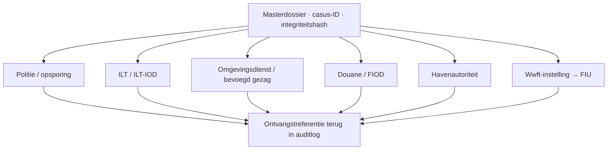

# Meldingsprotocol milieu-, olie- en ketenfraudesignalen

**Versie:** 1.0 — 16 juli 2026  
**Doel:** een juridisch en praktisch verantwoord overdrachtspakket voor politie, ILT/ILT-IOD, omgevingsdienst of ander bevoegd gezag, Douane/FIOD, havenautoriteit en—uitsluitend via meldingsplichtige instellingen—FIU-Nederland.  
**Afbakening:** Nederlands startpunt, defensief gebruik, openbare informatie en rechtmatig verkregen bedrijfsgegevens. Geen juridisch advies en geen garantie dat een instantie onderzoek instelt.

## 1. Eerst veiligheid, dan dossier

| Situatie | Eerste actie |
|---|---|
| Acuut gevaar voor personen, brand, explosie, heterdaad of directe ernstige dreiging | Bel 112 en volg instructies; ga niet zelf onderzoeken |
| Spoedeisende ILT-situatie binnen ILT-domein | Bel ILT 088-489 00 00; dien daarna het vereiste formulier in |
| Acute milieuschade of lozing | Waarschuw incident-/havenkanaal en het bevoegde gezag; bij groot oppervlaktewater Rijkswaterstaat 0800-8002 |
| Geen spoed, mogelijk strafbaar feit | Politie 0900-8844 of officieel online meld-/tipformulier |
| Zware/georganiseerde milieucriminaliteit of transportfraude | ILT-IOD Infodesk of, bij noodzaak tot bronafscherming, ILT-IOD TCI |
| Mogelijke illegale grensoverschrijdende afvalstroom | ILT/ILT-IOD; bij lopende EVOA-transporten tevens de voorgeschreven DIWASS-/kennisgevingsroute |
| Motorbrandstof-/accijnsfraude of douanefraude | Douane Meldpunt Accijnsfraude en/of FIOD volgens de officiële route |
| Bunkerhoeveelheids-, kwaliteits- of debunkeringincident in haven | Havenmeester/HCC volgens lokale vergunning- en meldvoorwaarden |
| Ongebruikelijke financiële transactie | Alleen de toepasselijke Wwft-meldingsplichtige instelling meldt bij FIU; andere partijen gebruiken politie/FIOD/Douane of eigen bank/compliance |

**Niet doen:** een verdachte partij confronteren, tanks openen, monsters nemen zonder bevoegdheid of veiligheidsplan, systemen binnendringen, andermans accounts gebruiken, documenten meenemen, persoonsgegevens breed rondsturen of een operatie volgen als dat gevaar oplevert.

## 2. Eén masterdossier, meerdere doelgerichte meldingen

Stuur niet blind hetzelfde archief naar iedere instantie. Bouw één onveranderlijk masterdossier en maak per ontvanger een kort voorblad met alleen de gegevens die voor diens bevoegdheid relevant en rechtmatig deelbaar zijn.



Elke verzending krijgt:

1. dezelfde casus-ID;
2. ontvanger, kanaal, datum/tijd en verzender;
3. exacte bestandenlijst en hashes;
4. reden waarom deze instantie passend is;
5. eventuele beperkingen op herkomst, vertrouwelijkheid of bronbescherming;
6. ontvangst- of referentienummer;
7. vastlegging van latere aanvullingen als nieuwe versie, nooit als stille vervanging.

## 3. Feit, bronverklaring, hypothese en conclusie scheiden

| Code | Categorie | Schrijfwijze | Voorbeeld |
|---|---|---|---|
| F | Direct vastgesteld feit | Wie/wat/waar/wanneer + bron-ID | “BDN X vermeldt 846,0 ton en seal S-7781.” |
| B | Verklaring van een bron | Letterlijk als verklaring toeschrijven | “Medewerker Y verklaarde op datum Z dat…” |
| O | Eigen observatie | Zintuiglijk/technisch beschrijven zonder duiding | “Op foto P03 is lekkage bij aansluiting zichtbaar.” |
| H | Werkhypothese | Voorwaardelijk en toetsbaar formuleren | “Mogelijk hoort CoQ C niet bij deze partij; te toetsen via terminaltanklog.” |
| A | Alternatieve verklaring | Minstens één legale/onschuldige mogelijkheid | “Verschil kan ook door ROB, temperatuur of timing komen.” |
| C | Bevoegde of deskundige conclusie | Auteur, bevoegdheid, methode en reikwijdte noemen | “Lab L rapporteert met methode M boven grens G; juridische status niet beoordeeld.” |
| U | Onbekend / niet vastgesteld | Expliciet open laten | “Niet vastgesteld wie de fysieke ontvanger was.” |

Vermijd formuleringen als “bedrijf X dumpt afval” zolang dat niet bevoegd is vastgesteld. Schrijf bijvoorbeeld: “Dezelfde partij wordt in document D1 als product en in document D2 als afval aangeduid; de overgang en grondslag zijn niet aangetroffen.”

## 4. Urgentietriage

| Niveau | Criteria | Handeling |
|---|---|---|
| T0 — direct | Levensgevaar, brand/explosie, actuele illegale lozing, verdwijnende gevaarlijke partij of heterdaad | Telefonisch alarmkanaal; locatie en gevaar voorop; dossier later |
| T1 — binnen uren | Schip/transport staat op vertrek, sample/beelden dreigen verloren te gaan, lopende grenspassage, ernstige schade kan doorgaan | Passende operationele autoriteit en opsporings-/inspectiekanaal bellen; vraag hoe bewijs veilig te stellen |
| T2 — binnen 1 werkdag | Sterke V3-inconsistentie, herhaalde partijwissel, onbevoegde ontvanger, document-/statusconflict | Samenvatting en kernbijlagen via officiële route; ontvangst vastleggen |
| T3 — regulier | Historisch patroon, OSINT-netwerk, beleids- of toezichtslacune zonder actuele partij | Gestructureerde schriftelijke melding of onderzoeksnotitie |

Urgentie wordt bepaald door gevaar, verliesrisico en operationele tijdlijn—niet door de overtuiging van de melder.

## 5. Routeringsmatrix

| Instantie | Wanneer passend | Wat voorop | Wat niet veronderstellen |
|---|---|---|---|
| Politie | Mogelijk strafbaar feit, ondermijning, bedreiging, valsheid, fraude, opzettelijke milieuschade | Feiten, tijd/plaats, betrokken assets, actuele risico’s, veiliggesteld bewijs | Dat een tip automatisch aangifte of onderzoek is |
| ILT toezicht | Overtreding binnen ILT-domein, afvaltransport, gevaarlijke stoffen, transport/milieu | Regel-/vergunningsrelatie, transportstatus, bestemming, documenten | Dat iedere lokale milieuactiviteit onder ILT valt |
| ILT-IOD | Mogelijke zware/georganiseerde milieucriminaliteit, grootschalige fraude, illegale EVOA-stroom | Crimineel patroon, netwerk, financieel voordeel, herhaling, bronbescherming | Dat TCI hetzelfde is als volledig anoniem melden; TCI kent identiteit maar schermt die af |
| Omgevingsdienst/bevoegd gezag | Lokale milieubelastende activiteit, vergunning, opslag, verwerking, emissie of klacht | Exacte locatie, activiteit, vergunninghouder, tijd, waargenomen effect | Dat de omgevingsdienst altijd zelf formeel bevoegd gezag is; gemeente/provincie/Rijk kan bevoegd zijn |
| Douane | Accijns op motorbrandstof, in-/uitvoer, oorsprong, douanestatus of grensdocumenten | Goederenstroom, code, aangifte, route, waarde, vergunning, accijnssignaal | Dat algemene witwasinformatie rechtstreeks bij Douane hoort; officiële route verwijst vaak naar FIOD/MMA |
| FIOD | Financiële/fiscale fraude, witwassen, illegale handel met fiscaal/financieel spoor | Geldstroom, facturen, UBO/actoren voor zover rechtmatig bekend, relatie met goederen | Dat een particulier een FIU-melding doet |
| Havenautoriteit | Actuele bunker-, debunker-, STS-, veiligheids-, hoeveelheids- of havenvergunningskwestie | Schip/IMO, ligplaats, tijden, barge, BDN/MFM, incident, operationele maatregel | Dat havenmelding strafrechtelijke of afvalmelding vervangt |
| FIU-Nederland | Alleen ongebruikelijke transactie door Wwft-meldingsplichtige instelling volgens toepasselijke indicatoren | Transactiegegevens, cliënt/UBO, indicator, reden ongebruikelijkheid | Dat een burger of niet-meldingsplichtig bedrijf rechtstreeks in het meldportaal hoort te melden |

## 6. Officiële Nederlandse routes op peildatum

### Politie

- Spoed of heterdaad: **112**.
- Geen spoed, wel politie: **0900-8844**.
- Algemene tip: officieel politie-tipformulier.
- Volledig anoniem: Meld Misdaad Anoniem, **0800-7000** of online.
- Vertrouwelijk met bronafscherming: Team Nationale Inlichtingen/TCI via de officiële politieroute; TCI kent de identiteit, maar schermt die af.

Bronnen: [Politie — meld ondermijning](https://www.politie.nl/informatie/meld-ondermijning.html), [Politie — tip geven](https://www.politie.nl/headless-api/contact/tip-geven.html), [Politie — Meld Misdaad Anoniem](https://www.politie.nl/informatie/misdrijven-melden-bij-meld-misdaad-anoniem.html/).

### ILT en ILT-IOD

- Spoedmelding ILT: **088-489 00 00**, gevolgd door het toepasselijke meldformulier.
- ILT-IOD Infodesk: **070-456 65 23** en **iod.infodesk@ilent.nl**.
- ILT-IOD TCI voor afgeschermde identiteit bij zware/georganiseerde criminaliteit: **070-456 45 77** op werkdagen volgens de actuele ILT-pagina.
- Onderwerpen omvatten expliciet illegale grensoverschrijdende afvalstromen, ernstige bodemvervuiling, gevaarlijke stoffen en malafide praktijken in transport.

Bronnen: [ILT — (spoed)melding](https://www.ilent.nl/service/contact/melding), [ILT-IOD — criminaliteit melden](https://www.ilent.nl/ilt-iod/criminaliteit-melden), [ILT — EVOA-transport melden](https://www.ilent.nl/onderwerpen/afval/afvaltransport-evoa/afvaltransport-melden-wijzigen-en-retour).

### Omgevingsdienst en ander bevoegd gezag

De gemeente is meestal bevoegd gezag voor milieubelastende activiteiten, maar provincie of Rijk kan bevoegd zijn, met name bij complexe bedrijven of bijzondere activiteiten. De omgevingsdienst voert vaak VTH-taken uit. Gebruik het Omgevingsloket voor formele meldingen/aanvragen wanneer dat de voorgeschreven route is; algemene milieuklachten gaan naar de regionale omgevingsdienst. Een verkeerd ontvangen melding van dreigende milieuschade hoort door de overheid naar het bevoegde gezag te worden doorgestuurd, maar verifieer zelf de ontvangst.

Bronnen: [IPLO — bevoegd gezag milieubelastende activiteit](https://iplo.nl/regelgeving/instrumenten/vergunningverlening-toezicht-handhaving/bevoegd-gezag-omgevingswet/milieubelastende-activiteit/), [IPLO — samen milieucriminaliteit aanpakken](https://iplo.nl/publish/pages/197600/kernboodschap.pdf), [IPLO — dreigende milieuschade](https://iplo.nl/regelgeving/wet-milieubeheer/milieuaansprakelijkheid/vragen-antwoorden/vragen-milieuaansprakelijkheid/weet-bg-dreigende-milieuschade/).

### Douane en FIOD

Douane noemt financiële fraude, illegale handel en accijnsfraude. Financiële fraude wordt via FIOD of Meld Misdaad Anoniem gemeld; accijnsfraude kan ook via het Meldpunt Accijnsfraude van Douane. Een melding onder eigen naam kan in een onderzoeksdossier terechtkomen. Kies vóór verzending bewust tussen regulier, vertrouwelijk/TCI en volledig anoniem.

Bronnen: [Douane — fraude met douanezaken melden](https://www.douane.nl/contact/fraude-melden/), [Douane — accijnsfraude](https://www.douane.nl/onderwerpen/accijns-en-verbruiksbelasting/accijnsfraude-melden/).

### Havenautoriteit

Gebruik bij een actuele operatie de lokale Harbour Master/HCC-route en de toepasselijke vergunningvoorwaarden. In Rotterdam moeten kwaliteit- en hoeveelheidsklachten met relevante stukken binnen de geldende termijnen worden gemeld; debunkering heeft eigen formulier-, sample-, checklist- en tijdmeldingen. Controleer altijd de actuele havenregels en meldtermijn.

Bronnen: [Port of Rotterdam — vergunningen en aanvragen](https://www.portofrotterdam.com/en/applications-permits-and-exemptions), [Rotterdam bunkerlicentie 2024](https://www.portofrotterdam.com/sites/default/files/2024-08/bunkervergunning-2024.pdf), [Rotterdam bunker complaint form](https://www.portofrotterdam.com/sites/default/files/2021-06/complaint-form-bunkering.pdf).

### FIU-Nederland

Alleen een instelling die onder de Wwft als meldingsplichtige instelling valt, meldt een ongebruikelijke transactie volgens de indicatoren voor haar meldergroep. Het protocol mag daarom nooit instrueren dat een willekeurige burger, analist of niet-meldingsplichtige onderneming rechtstreeks een FIU-melding indient. Deel het signaal zo nodig met een eigen Wwft-/compliancefunctie, bank, politie of FIOD; die partij maakt haar eigen wettelijke beoordeling. Houd rekening met geheimhoudings-/tipping-offregels en bespreek een FIU-melding niet onnodig met betrokkenen.

Bron: [FIU-Nederland — ongebruikelijke transactie melden](https://www.fiu-nederland.nl/faq/hoe-meld-ik-een-ongebruikelijke-transactie/).

## 7. Bewijs veiligstellen zonder zelf opsporingsdienst te worden

### Digitale bestanden

1. Bewaar het origineel read-only; werk op een kopie.
2. Registreer oorspronkelijke bestandsnaam, bron, verkrijgingswijze, datum/tijd, formaat en grootte.
3. Bereken SHA-256 en leg tool/moment vast.
4. Exporteer waar rechtmatig mogelijk metadata en auditlogs zonder het origineel te wijzigen.
5. Maak screenshots alleen als aanvulling; bewaar ook bronbestand, URL en tijd.
6. Leg latere wijzigingen vast als nieuwe versie met nieuwe hash.
7. Gebruik versleutelde opslag en beperk toegang op need-to-knowbasis.

### Documenten

1. Nummer iedere pagina of scan als afzonderlijke exhibit.
2. Bewaar envelop, begeleidend bericht en digitale headers indien relevant en rechtmatig beschikbaar.
3. Schrijf niet op het origineel en verwijder geen nietjes, seals of labels.
4. Noteer wie het document wanneer heeft ontvangen, ingezien, gekopieerd en overgedragen.

### Monsters en fysieke zaken

Neem niet zelf onbevoegd of onveilig monsters. Bij bestaande rechtmatig verkregen monsters: registreer sample-ID, tank/partij, punt, methode, tijd, seal, hoeveelheid, container, opslagconditie en iedere overdracht. Vraag politie, ILT, havenautoriteit of een bevoegde/geaccrediteerde monsternemer wat nodig is vóór her-bemonstering of opening.

### OSINT

Bewaar URL, publicatiedatum, raadpleegdatum, relevante passage en een lokale kopie waar dat rechtmatig mag. Maak duidelijk wat bronfeit is en wat eigen inferentie. Omzeil geen login, betaalmuur, toegangsbeperking of technisch beveiligingsmiddel.

## 8. Minimale overdrachtsset

| Onderdeel | Inhoud |
|---|---|
| 00 Voorblad | Casus-ID, ontvanger, urgentie, contact, vertrouwelijkheid, concrete verzoekvraag |
| 01 Eén-pagina samenvatting | Wie/wat/waar/wanneer, waarom deze instantie, actueel risico |
| 02 Feitenregister | Genummerde F/B/O/C/U-items met bron-ID |
| 03 Hypotheseregister | H-items, alternatieve verklaringen en benodigde toets |
| 04 Tijdlijn | Gebeurtenis, tijdzone, bron, zekerheid |
| 05 Actor-/assetlijst | Rollen, geen schuldlabels; schip/IMO, tank, batch, onderneming, vergunning |
| 06 Partijlineage | Parent-child, splits, merges, tankwissels, statusovergangen |
| 07 Stoffenbewijs | Sample, chain-of-custody, labmethode, resultaten, onzekerheid |
| 08 Documentbewijs | BDN, CoQ, factuur, customs, afvaldocument, vergunning, ontvangstbewijs |
| 09 Massabalans | Opening, input, output, closing, normalisatie en onverklaard verschil |
| 10 Financieel spoor | Alleen rechtmatig verkregen facturen/betalingen; relatie met goederen |
| 11 Broninventaris | Bestand, herkomst, verkrijgingswijze, hash, privacyclassificatie |
| 12 Open vragen | Wat ontbreekt en welke instantie kan dat bevoegd verkrijgen? |
| 13 Verzendlog | Ontvanger, tijd, kanaal, bestanden, hash, referentie en vervolg |

## 9. Eén-pagina meldsjabloon

```text
CASUS-ID:
DATUM/TIJD + TIJDZONE:
ONTVANGER EN OFFICIEEL KANAAL:
URGENTIE: T0 / T1 / T2 / T3

1. AANLEIDING
In maximaal drie zinnen: wat is waargenomen en waarom nu melden?

2. DIRECT RISICO
Personen / milieu / vertrek transport / verlies bewijs / geen direct risico.

3. VASTGESTELDE FEITEN
F01 … [bron E01]
F02 … [bron E02]

4. WERKHYPOTHESE
H01 Mogelijk …; te toetsen door …

5. ALTERNATIEVE VERKLARINGEN
A01 …

6. RELEVANTE ASSETS EN PARTIJ
Schip/IMO, tank, batch, voertuig, locatie, tijdvak.

7. VEILIGGESTELD BEWIJS
Bestands-/exhibit-ID, herkomst, hash, chain-of-custody.

8. OPEN VRAGEN / GEWENSTE ACTIE
Welke concrete bevoegdheid of controle wordt gevraagd?

9. MELDER EN CONTACTVOORKEUR
Naam/organisatie óf gekozen anonieme/afgeschermde route.
```

## 10. Instantie-specifieke voorbladen

### Politie / ILT-IOD

Benadruk mogelijke strafbare gedraging zonder schuld vast te stellen, patroon/herhaling, netwerkrollen, wederrechtelijk voordeel als hypothese, acuut bewijsverlies en de relatie tussen stof-, document-, goederen- en geldspoor.

### Toezichthouder / omgevingsdienst

Benadruk activiteit, locatie, installatie, vergunningvoorwaarden, feitelijke emissie/opslag/verwerking, product-/afvalstatus, ontvangersbevoegdheid en gewenste toezichtmaatregel.

### Douane / FIOD

Benadruk grensmoment, aangifte-/documentreferenties, goederen-/accijnscode, oorsprong, waarde, route, feitelijke transformatie en geldstroom. Voeg geen bankgegevens toe die niet rechtmatig zijn verkregen.

### Havenautoriteit

Benadruk operationele veiligheid, schip/IMO, barge, ligplaats, tank, BDN, MFM, samples, start/einde, Letter of Protest, voorgenomen vertrek en gewenste operationele beslissing.

### Wwft-instelling / FIU

De meldingsplichtige instelling past haar eigen indicatoren en procedures toe. Het overdrachtspakket kan feiten aan de interne compliancefunctie leveren, maar schrijft de FIU-kwalificatie niet voor en wordt niet met de cliënt besproken wanneer geheimhouding geldt.

## 11. Privacy, proportionaliteit en bronbescherming

- Deel persoonsgegevens alleen wanneer noodzakelijk, relevant en via een passend beveiligd kanaal.
- Scheid publieke bedrijfsgegevens, vertrouwelijke bedrijfsinformatie, bijzondere persoonsgegevens en bronidentiteit.
- Stuur geen complete mailbox, telefoon of personeelsdossier wanneer een beperkte selectie volstaat.
- Kies vóór het eerste contact bewust tussen melden onder naam, volledig anoniem en TCI-bronafscherming; deze routes zijn niet hetzelfde.
- Beloof een bron nooit anonimiteit die u technisch of juridisch niet zelf kunt garanderen.
- Als informatie onder beroepsgeheim, contractuele geheimhouding, onderzoeksbeperking of klokkenluidersregeling kan vallen: vraag vooraf onafhankelijk juridisch advies.
- Publiceer beschuldigingen niet online; meld gericht aan bevoegde instanties.

## 12. Kwaliteitscontrole vóór verzending

| Vraag | Ja/nee |
|---|---|
| Is acuut gevaar via het juiste alarmkanaal gemeld? |  |
| Zijn feiten, bronverklaringen, observaties en hypotheses gescheiden? |  |
| Heeft iedere kernclaim een bron-ID? |  |
| Zijn alternatieve verklaringen vermeld? |  |
| Zijn datum, tijdzone, locatie, partij- en asset-ID eenduidig? |  |
| Zijn originelen behouden en hashes gecontroleerd? |  |
| Is duidelijk hoe ieder bestand rechtmatig is verkregen? |  |
| Is de ontvanger bevoegd of logisch passend? |  |
| Is de gegevensset proportioneel en beveiligd? |  |
| Is de concrete gewenste actie geformuleerd? |  |
| Is ontvangstbevestiging/referentie gevraagd? |  |
| Is FIU alleen genoemd via een toepasselijke Wwft-meldingsplichtige instelling? |  |

## 13. Na de melding

1. Bevries de verzonden versie en bewaar de hash.
2. Noteer ontvangst, referentie, contactpersoon en instructies.
3. Lever aanvullingen als genummerd addendum; wijzig de oorspronkelijke melding niet.
4. Deel niet publiek dat een melding of FIU-proces loopt.
5. Voorkom parallelle, tegenstrijdige versies bij verschillende instanties.
6. Vraag bij acuut veranderde omstandigheden opnieuw om triage; vertrouw niet alleen op de eerdere melding.
7. Leg vast wat u niet meer doet omdat een bevoegde instantie het onderzoek heeft overgenomen.

---

**Gebruikssamenvatting:** meld vroeg genoeg om schade of bewijsverlies te voorkomen, maar formuleer precies genoeg om feit, hypothese en bevoegd oordeel niet door elkaar te halen.
