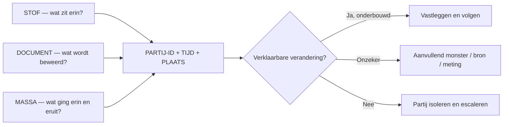

# Stoffen-, documenten- en massabalansmatrix voor bunker- en retourpartijen

**Versie:** 1.0 — 16 juli 2026  
**Doel:** defensieve detectie van onverklaarde veranderingen in samenstelling, identiteit, hoeveelheid, waarde en juridische status van bunkerbrandstof.  
**Gebruik:** dossieropbouw, kwaliteitsgeschil, debunkering, product-/afvalbeoordeling en overdracht aan bevoegde instanties.  
**Afbakening:** geen juridisch of laboratoriumadvies; geen mengrecepten, verhullingsmethoden of automatische fraudebeschuldigingen.

## 1. Kernmodel

Een betrouwbaar signaal ontstaat door drie onafhankelijke sporen te koppelen:



Geen van de drie sporen is op zichzelf beslissend:

- een afwijkende stof kan ontstaan door normale variatie, incompatibiliteit, tankresidu, verkeerde behandeling of contaminatie;
- een correct ogend document kan bij de verkeerde tank, partij, tijd of fysieke leverancier horen;
- een massaverschil kan worden veroorzaakt door temperatuurcorrectie, meetonzekerheid, ROB, lijninhoud, water, timing of administratieve afgrenzing;
- overeenstemming met één productspecificatie beantwoordt niet automatisch de juridische afvalvraag;
- afvalstatus is niet uitsluitend een chemische grenswaarde, maar hangt ook samen met herkomst, gebruiksgeschiktheid, behandeling, intentie van de houder en toepasselijk recht.

## 2. Bewijs- en actieniveaus

| Niveau | Betekenis | Actie |
|---|---|---|
| V0 — niet toetsbaar | Partij-ID, representatief monster, document of meetbasis ontbreekt | Geen inhoudelijke conclusie; gegevens veiligstellen |
| V1 — intern consistent | Gegevens binnen één spoor lijken te kloppen | Onafhankelijke koppeling met de andere twee sporen |
| V2 — kruislings bevestigd | Minstens twee onafhankelijke sporen wijzen naar dezelfde partij en gebeurtenis | Alternatieve verklaringen toetsen |
| V3 — onverklaarde inconsistentie | Verschil blijft bestaan na controle van methode, timing en legale processtap | Partij isoleren; bevoegde functionaris inschakelen |
| V4 — institutioneel vastgesteld | Bevoegde autoriteit, geaccrediteerd lab of rechter heeft status/feit vastgesteld | Uitkomst en beperkingen exact overnemen |

V3 betekent een onderzoeksplicht, niet automatisch fraude.

## 3. Representativiteit vóór interpretatie

| Controle | Minimale vraag | Rode vlag voor bewijswaarde |
|---|---|---|
| Monsterpunt | Waar in tank, leiding of manifold is bemonsterd? | Monsterpunt niet bekend of niet passend bij onderzoeksvraag |
| Monstermoment | Vóór, tijdens of na transfer/behandeling? | Monster genomen na samenvoegen of tankreiniging zonder lineage |
| Methode | Continu drip, spot, running, composite of tank sample? | Eén spotmonster wordt als representatief voor heterogene tank gebruikt |
| Partij-ID | Welke tank-, batch-, BDN- en casus-ID horen erbij? | Alleen scheepsnaam of handelsnaam op label |
| Seal | Uniek, intact en in BDN/checklist geregistreerd? | Sealnummer ontbreekt, dubbel voorkomt of is gecorrigeerd zonder auditspoor |
| Bewakingsketen | Wie had monster wanneer onder zich? | Tijdgat, onbekende opslag of ongeautoriseerde opening |
| Homogeniteit | Was de partij voldoende homogeen voor de methode? | Fasevorming, sediment of water zonder aangepast samplingplan |
| Container | Geschikt, schoon, droog en correct gevuld? | Onbekende container of mogelijke contaminatie door verpakking |
| Lab | Geaccrediteerd voor matrix en methode? | Alleen commerciële uitslag zonder methode, LOQ of kwaliteitscontrole |
| Tegenmonster | Onafhankelijk verzegeld deel beschikbaar? | Geen mogelijkheid tot reproduceerbare contra-analyse |

IMO-richtlijnen verlangen voor de MARPOL-delivery sample in beginsel continue bemonstering aan de receiving ship inlet bunker manifold gedurende de levering, een verzegelde container en een label met onder meer plaats, methode, datum, leverancier, schip, IMO-nummer, ondertekenaars, seal en productnaam. De sealreferentie hoort ook op de BDN terug te komen.

**Bronnen:** [IMO fuel-oil quality — Regulation 18](https://www.imo.org/en/ourwork/environment/pages/fuel-oil-quality-%E2%80%93-regulation-18.aspx), [IMO sampling guidelines MSC-MEPC.2/Circ.18](https://wwwcdn.imo.org/localresources/en/OurWork/Environment/Documents/annex/MSC-MEPC.2-Circ.18%20-%20Guidelines%20For%20The%20Sampling%20Of%20Fuel%20Oil%20For%20Determination%20Of%20Compliance%20With%20Marpol%20Annex...%20%28Secretariat%29.pdf).

## 4. Stoffenmatrix

### 4.1 Routine brandstof- en gebruiksparameters

| Parametergroep | Wat zij defensief kan toetsen | Mogelijke legale/operationele verklaring | Vereiste koppeling | Niet concluderen op basis van alleen deze uitslag |
|---|---|---|---|---|
| Dichtheid | Productconsistentie; volume-naar-massaconversie; vergelijking CoQ/BDN | Temperatuur- of methodeverschil; blendvariatie | Temperatuur, methode, CoQ, MFM/tankmeting | Herkomst of afvalstatus |
| Viscositeit | Pompbaarheid, verstuiving en gradeconsistentie | Temperatuur, aging, blending binnen specificatie | Testtemperatuur, grade, handlinglog | Welke vreemde stof aanwezig is |
| Zwavel | MARPOL/contractuele conformiteit en mogelijke partijverwisseling | Scrubber-/equivalent-regime; verkeerde tank; commingling | BDN, vaargebied, scrubberstatus, tanklineage | Opzettelijke bijmenging |
| Vlampunt | Veiligheids- en vluchtige-componentensignaal | Producttype, lichte contaminatie, samplingverlies | Gesloten-cupmethode, SDS, grade, tankhistorie | Exacte bron van afwijking |
| Water | Vrij/emulgeerd water; massa- en verbrandingsimpact | Condens, ingress, tankwashingrest, slechte scheiding | Watermeting vóór/na, tankinspectie, ROB | Afvalfraude zonder herkomstbewijs |
| Sediment / total sediment | Opslagstabiliteit, sludging en operationele geschiktheid | Aging, incompatibiliteit, thermische geschiedenis | Klacht, filterlog, compatibility/stability-tests | Welke component is toegevoegd |
| Ash / carbon residue | Niet-brandbare rest en depositievorming | Normale residual-fuelvariatie | Grade, historische CoQ, motorgegevens | Juridische afvalstatus |
| Acid number | Corrosie-/zuurcomponentensignaal | Biocomponent, oxidatie, productchemie | Brandstoftype, FTIR/GC-MS-screening, historie | Identiteit van één contaminant zonder confirmatie |
| Pour point / cold-flow | Opslag- en verpompbaarheidsrisico | Waxy feedstock, temperatuurregime | Tankverwarming, weers-/operationele data | Afvalstatus |
| Calorische waarde | Energie-inhoud en economische plausibiliteit | Productvariatie, water/inert materiaal | Contract, toepassing, water/ash, prijs | Fraude-intentie |
| Ignition/combustion indicators | Motorcompatibiliteit en ontstekingsgedrag | Aromaticiteit, grade, motorinstelling | Motorlog, density/viscosity, toepasselijke norm | Universele bruikbaarheid voor ieder schip |

### 4.2 Elementen, halogenen en screeningssignalen

| Groep | Defensieve betekenis | Alternatieve verklaring | Aanvullende bevestiging |
|---|---|---|---|
| Aluminium + silicium | Catalytic-fines/abrasierisico; vergelijking met CoQ en treatment | Raffinageherkomst; onvoldoende centrifugering | Methode, homogeniteit, separatorlog, tegenmonster |
| Natrium, calcium, magnesium | Zoutwater-, additive- of productprofiel | Zeewateringress, additives, feedstock | Water/chloride, tankinspectie, productspecificatie |
| Vanadium, nikkel, ijzer | Residual-fuel/feedstockprofiel en slijtage-/depositierisico | Normale ruwe-olieherkomst of tankcorrosie | Historische partijprofielen, ash, elementenscan |
| Lood, chroom, cadmium, arseen | Ongebruikelijk metaalprofiel; relevant in sommige used-oilregimes | Additives, proces- of tankhistorie, meetinterferentie | Totale analyse met passende methode; herkomst- en proceskennis |
| Totale halogenen | Screening voor halogeenhoudende componenten in used-oilcontext | Zout/chloride kan interpretatie beïnvloeden; jurisdictie verschilt | Organisch/inorganisch onderscheid en gerichte confirmatie |
| PCB-screening | Mogelijk gereguleerd contaminatiesignaal | Kruiscontaminatie of analytische interferentie | Juridisch voorgeschreven confirmatiemethode en bevoegd lab |
| GC-MS/FTIR onbekenden | Niet-routinematige organische componenten of afwijkend fingerprint | Legitiem additievenpakket, bio-/synthetische component, carry-over | Blank, library match, referentiemonster, gerichte kwantificatie |
| Headspace/volatile screening | Vluchtige componenten die veiligheid/flashpoint beïnvloeden | Sampling- of opslagverlies, reinigingsrest | Onafhankelijke flashpointtest, tankhistorie, confirmatie-analyse |

De Amerikaanse EPA-used-oil specificatie noemt onder meer arseen, cadmium, chroom, lood, totale halogenen en vlampunt. Die waarden zijn een **Amerikaans used-oil verbrandingsregime**, geen universele bunkerbrandspecificatie en geen automatische Europese afvalclassificatie. EPA benadrukt ook dat een totals analysis, niet automatisch een leaching test, passend kan zijn wanneer het doel de samenstelling van used oil voor energieterugwinning is.

**Bronnen:** [EPA Managing Used Oil — business FAQ](https://www.epa.gov/hw/managing-used-oil-answers-frequent-questions-businesses), [EPA Hazardous Waste Characteristics](https://www.epa.gov/hw-sw846/hazardous-waste-characteristics), [EU Waste Framework Directive — hazardous properties](https://eur-lex.europa.eu/legal-content/EN/TXT/?uri=CELEX%3A02008L0098-20240218).

### 4.3 Interpretatieregels voor stoffen

1. Vergelijk altijd dezelfde matrix, methode, eenheid, temperatuurconditie en basis (massa/volume, dry/as received).
2. Noteer detectielimiet, kwantificatielimiet en meetonzekerheid; “niet aangetoond” is niet hetzelfde als afwezig.
3. Een routine ISO-panel kan contractconformiteit toetsen maar sluit niet iedere niet-routinematige component uit.
4. Een breed screeningssignaal moet met een gerichte methode en onafhankelijk tegenmonster worden bevestigd.
5. Vergelijk meerdere ketenpunten alleen als partijlineage en monsterrepresentativiteit aantoonbaar zijn.
6. Pas geen grenswaarde uit een andere jurisdictie of ander gebruiksdoel toe zonder juridische en methodische onderbouwing.
7. Behoud ruwe chromatogrammen, spectra, calibratie- en QC-data wanneer escalatie voorzienbaar is.

## 5. Documentenmatrix

| Document / record | Sleutelvelden | Kruiscontrole | Typische onschuldige verklaring | Escalatiesignaal |
|---|---|---|---|---|
| Bunker Delivery Note (BDN/eBDN) | Nummer, datum, schip/IMO, leverancier, product, massa/volume, dichtheid, zwavel, flashpoint/declaratie, sample seal | CoQ, order, MFM, tank-ID, invoice, MARPOL sample | Administratieve correctie met auditspoor | Nummer, seal, product of massa wijzigt zonder ondertekende correctie |
| Certificate of Quality (CoQ) | Batch, tank, datum, methoden, resultaten, lab/terminal | BDN-product en daadwerkelijke geladen tank | CoQ is blend-/shoretankgemiddelde | CoQ predatert batchvorming of verwijst naar andere tank |
| Sales/order confirmation | Grade, hoeveelheid, specificatie, leverplaats, koper/verkoper | BDN en factuur | Contractuele tolerantie | Fysieke leverancier/grade wijkt af zonder addendum |
| Factuur/credit note | Eenheidsprijs, hoeveelheid, product, partijen, belasting | BDN, payment, prijsbenchmark, retourovereenkomst | Marktprijs- of claimschikking | Grote prijsval en nieuwe productomschrijving zonder behandeling |
| MFM delivery record | Meter-ID, begin/eind, totalizer, flow, density, temperature, alarms, events | BDN, calibration, seal, raw data | Toegestane operationele stop | Alleen samenvatting; ruwe data of eventlog ontbreekt |
| Tank sounding/ullage report | Tank-ID, hoogte/ullage, temperatuur, water, tabel, trim/list | Tank table, ROB, BDN/MFM | Meetonzekerheid en scheepsbeweging | Andere tanktabel/eenheid of onverklaarde correctiefactor |
| Sample register | Sample-ID, punt, tijd, methode, seal, custodian | BDN, checklist, lab chain-of-custody | Extra commerciële samples | Seal dubbel, tijd buiten transfer of sample-ID hergebruikt |
| Lab report | Sample-ID, methode, resultaat, eenheid, uncertainty/LOQ, accreditatie | Sample register, CoQ, klacht | Andere methode/basis | Partij-ID ontbreekt of rapport is handmatig overschreven |
| Tank movement log | Opening, receipts, transfers, blends, closing | Terminal stock, batchlineage, MFM | Lijnverplaatsing/recirculatie | Negatieve voorraad of receipt zonder bronbatch |
| Barge cargo log | Vorige cargo, tankcleaning, loads/discharges, ROB | CoQ, terminal receipt, BDN | Legitiem compatible carry-over | Tank “empty” terwijl ROB/cleaning niet is gedocumenteerd |
| Debunkerformulier/checklist | Reden, tank, sample, status, ontvanger, bestemming, start/einde | BDN, klacht, vergunning, ontvangstbewijs | Operationele terugname | Productstatus gekozen ondanks vastgelegde onbruikbaarheid zonder motivering |
| Afvaldocument/notification | Afvalcode, producent/houder, vervoerder, ontvanger, behandeling, massa | Statusbesluit, vergunningen, douane, weighbridge | Classificatiecorrectie | Productfactuur en afvaldocument beschrijven dezelfde partij tegenstrijdig |
| Bill of Lading / cargo manifest | Shipper, consignee, origin, product, massa, tank/lot | Terminal, customs, CoQ, STS-record | Trader-/consigneewijziging | Oorsprong of product verandert zonder fysieke transformatie |
| Customs declaration | HS/CN-code, oorsprong, waarde, hoeveelheid, procedure | Invoice, B/L, product-/afvalstatus | Correctie of ruling | Afval-/productcode verschuift rond grenspassage zonder statusbesluit |
| Vergunning/register | Activiteit, stof/afvalcode, locatie, geldigheid, voorwaarden | Ontvangsttijd, asset, behandeling | Tijdelijke/algemene vergunning | Ontvanger mag product handelen maar niet betreffende afvalstroom behandelen |
| AIS/VTS/port call | Tijd, locatie, schip, berth/anchorage | Transfermelding, BDN, STS, agent | AIS-fout of ontvangstverlies | Transferdocument op tijd/plaats die fysiek niet plausibel is |
| Weighbridge/terminal receipt | Gross/tare/net, tijd, vehicle/vessel, batch | Afvaldocument, stock, invoice | Verschil door schaalbasis | Duplicaat ticket of massa buiten ontvangen partij |
| Behandelings-/blendrecord | Inputs, proces, outputs, losses, sample/CoQ | Vergunning, massabalans, end-of-wasteclaim | Normale processing loss | Outputclaim zonder procesdata, nieuwe analyse of residustroom |
| Betaling/bankreferentie | Bedrag, valuta, payer/payee, invoice | Contract, factuur, ownership timeline | Financier/trader | Betaling aan niet-verklaarde derde of tegengestelde geldstroom |

De IMO eBDN-dataset biedt nuttige interoperabele velden, waaronder supplier licence, CoQ-reference, flashpoint, temperatuur, pumping rate, samplelocatie en Letter of Protest-indicator. Dat maakt automatische kruiscontrole mogelijk zonder te veronderstellen dat digitale consistentie ook fysieke juistheid bewijst.

**Bronnen:** [IMO Electronic Bunker Delivery Note dataset](https://imocompendium.imo.org/public/IMO-Compendium/Current/DS/Electronic%20Bunker%20Delivery%20Note/d11.htm), [IMO best practice for fuel-oil purchasers/users](https://wwwcdn.imo.org/localresources/en/OurWork/Documents/MEPC_1-Circ-875_Guidance%20On%20Best%20Practice%20For%20Fuel%20Oil%20PurchasersUsers.pdf).

## 6. Documentconsistentiematrix

Gebruik de volgende minimale sleutelrelaties:

| Sleutel | Moet identiek of verklaarbaar gekoppeld zijn in |
|---|---|
| Schip + IMO | BDN, samplelabel, port call, debunkerformulier, lab chain-of-custody |
| Partij-/batch-ID | CoQ, terminaltank, BDN, barge cargo log, lineage, labrapport |
| Tank-ID | Sounding, sample, movement log, transferplan, debunkerformulier |
| Sealnummer | Samplelabel, BDN, checklist, lab receipt |
| Datum/tijd | MFM, VTS/AIS, BDN, sample, tanklog, invoice/receipt |
| Product/grade | Order, CoQ, BDN, SDS, invoice, customs, receiver record |
| Massa + basis | MFM, BDN, invoice, tankstock, waste document, weighbridge |
| Leverancier/ontvanger | Contract, licence register, BDN, invoice, payment, receipt |
| Status | Productcontract, afvalbesluit, notification, customs, receiver permit |
| Bestemming/behandeling | Debunkerformulier, contract, transportdocument, ontvangst- en behandelingsbewijs |

### Correctieprotocol

Een documentcorrectie is niet automatisch verdacht wanneer zij:

1. het oorspronkelijke document intact laat;
2. auteur, tijdstip, reden en goedkeurder registreert;
3. naar dezelfde casus- en partij-ID verwijst;
4. downstream kopieën en systemen aantoonbaar bijwerkt;
5. geen fysiek onmogelijke tijdlijn creëert.

## 7. Massabalansmodel

### 7.1 Basisequatie per afgebakende partij

```text
Opening + Ontvangsten + Toegestane toevoegingen
− Uitgiften − Bemonstering − Aantoonbare operationele verliezen
= Berekende sluitvoorraad

Onverklaard verschil = Gemeten sluitvoorraad − Berekende sluitvoorraad
```

Bereken daarnaast relatief:

```text
Relatief verschil (%) = Onverklaard verschil / Referentiemassa × 100
```

De referentiemassa, tekenconventie en meetbasis moeten vooraf worden vastgelegd. Rond niet tussentijds af.

### 7.2 Vereiste normalisatie

| Factor | Controle |
|---|---|
| Massa versus volume | Vergelijk bij voorkeur massa; leg dichtheid en referentietemperatuur vast bij conversie |
| Temperatuur | Gebruik dezelfde temperatuurcorrectiebasis en bronwaarde |
| Water | Noteer of massa/volume gross, net, dry of as-received is |
| ROB/OBQ | Meet en identificeer restpartijen vóór en na transfer |
| Lijninhoud | Definieer wie leidinginhoud bezit en in welke partij zij valt |
| Timing | Laat opening en closing aansluiten op dezelfde cut-off |
| Tanktabel | Leg versie, kalibratie, trim/listcorrectie en meetpunt vast |
| MFM | Bewaar meter-ID, geldige kalibratie, seals, eventlog en ruwe totalizers |
| Sampling | Trek bekende monstermassa af wanneer relevant |
| Losses | Accepteer alleen benoemde, gekwantificeerde en technisch plausibele verliezen |

### 7.3 Balansen op vier niveaus

| Niveau | Invoer | Uitvoer | Typische breuk |
|---|---|---|---|
| Tank | Opening + receipts + interne transfers in | Deliveries + transfers out + closing | Verkeerde tank-ID, ROB, water, tanktabel |
| Barge/schip | Som tanks + ontvangsten | Leveringen + closing + aantoonbare losses | Lijninhoud, commingling, timing |
| Batch | Parent batches + toegestane toevoegingen | Child batches + residu + samples | Split/merge zonder lineage |
| Bedrijf/periode | Beginvoorraad + aankopen + productie | Verkoop + afvoer + eindvoorraad | Product/afvalomlabeling, dubbeltelling, verborgen ontvangst |

### 7.4 Massabalansmatrix per gebeurtenis

| Gebeurtenis | Minimale vergelijking | Eerst uitsluiten | Escaleren wanneer |
|---|---|---|---|
| Terminal → barge | Terminal MFM/shore tank versus barge receipt | Lijninhoud, tijd-cut-off, dichtheid | Verschil buiten gecombineerde meetonzekerheid zonder verklaring |
| Barge → schip | Barge MFM/BDN versus ship received | ROB, tank sounding, temperatuur, stop/restart | Ruwe MFM-data of eventlog ontbreekt bij geschil |
| Schip → debunkerbarge | Pre-tank + transfer + closing versus barge receipt | Heterogeniteit, water, tanktabel | Ontvangen massa en afgegeven partij-ID niet koppelbaar |
| Barge → terminal | Barge discharge versus terminal receipt | Lijnfill, shore tank cut-off | Nieuwe batch-ID zonder parent-childrecord |
| Blend/processing | Som inputs versus products + residues + losses | Water, samples, normale procesloss | Geen residustroom of output groter dan plausibele input |
| Split | Parent mass versus som child masses | Afronding, samples | Child batch zonder unieke ID/bestemming |
| Merge | Som parents versus merged opening | Timing, tank residue | Parent met onbekende status verdwijnt in productbatch |
| Grenspassage | Export mass/status versus import/receipt | Eenheden, customs cut-off | Product-, afvalcode, waarde en massa veranderen zonder behandeling |
| Verkoop/credit | Fysieke massa versus gefactureerd/gecrediteerd | Contracttolerantie | Geldstroom correspondeert niet met fysieke of juridische route |

MPA schrijft voor Singapore voor dat de BDN-hoeveelheid van Marine Fuel Oil op het goedgekeurde MFM-systeem wordt gebaseerd. SS660 omvat bij terminal-naar-bunkerbarge custody transfer zowel hoeveelheidsmeting en sampling als metrologische traceerbaarheid, calibratie en systeemintegriteit.

**Bronnen:** [MPA Mass Flow Meter for Bunkering](https://www.mpa.gov.sg/port-marine-ops/marine-services/bunkering/mass-flow-meter-for-bunkering), [MPA factsheet SS660:2020](https://www.mpa.gov.sg/api/media/23153dec-175b-460b-982e-52407a964dcb/annex-b---factsheet-on-ss-660-2020-on-code-of-practice-for-bunker-cargo-delivery-from-oil-terminal-to-bunker-tanker.pdf), [Port of Rotterdam bunkerlicentie-uitleg](https://www.portofrotterdam.com/sites/default/files/2025-03/explanatory-notes%20-bunkerlicense-2024.pdf).

## 8. Gecombineerde stoffen-documenten-massamatrix

| Patroon | Stof | Document | Massa | Beoordeling | Eerstvolgende defensieve stap |
|---|---|---|---|---|---|
| A | Past bij CoQ | Sleutels kloppen | Sluit binnen onzekerheid | Geen actieve inconsistentie | Dossier sluiten met beperkingen |
| B | Wijkt af | Sleutels kloppen | Sluit | Kwaliteits-/samplingvraag | Tegenmonster en methodecheck |
| C | Past bij CoQ | Sleutels conflicteren | Sluit | Identiteits-/documentvraag | Originele bronbestanden en partijlineage |
| D | Past bij CoQ | Sleutels kloppen | Sluit niet | Meet-/voorraadvraag | Ruwe MFM, tanktabel, ROB en cut-off |
| E | Wijkt af | Sleutels conflicteren | Sluit | Mogelijke partijverwisseling | Isoleer partij; onafhankelijke her-bemonstering |
| F | Wijkt af | Sleutels kloppen | Sluit niet | Mogelijke fysieke toevoeging/verlies of slechte representativiteit | Chain-of-custody, tankhistorie en breed/gericht labplan |
| G | Past bij productspecificatie | Product- en afvaldocument botsen | Sluit | Juridische statusvraag | Bevoegde afvalautoriteit; intentie/behandeling/bestemming |
| H | Na “behandeling” andere samenstelling | Procesrecord ontbreekt | Outputbalans onvolledig | Onbewezen transformatie | Input/outputmonsters, vergunning, residues en massabalans |
| I | Geen representatief monster | Documenten conflicteren | Sluit niet | Niet betrouwbaar concludeerbaar, wel hoog verificatiebelang | Bewijs veiligstellen; geen chemische conclusie simuleren |

## 9. Automatische controles die veilig te implementeren zijn

| Regel | Trigger | Uitvoer |
|---|---|---|
| Duplicaat seal | Zelfde seal aan meerdere niet-identieke samples | Kritieke datakwaliteitsmelding |
| Onmogelijke tijdlijn | Sample/lab/receipt vóór partijvorming of na gedocumenteerde merge | Tijdlijnmelding |
| Weesbatch | Child batch zonder parent of parent zonder disposition | Lineage-melding |
| Massa-eenheid | Massa en volume zonder dichtheid/temperatuurbasis vergeleken | Berekening blokkeren |
| Statusconflict | Zelfde partij tegelijk product en afval zonder gemotiveerde overgang | Juridische review |
| Vergunningsmismatch | Activiteit/afvalcode valt buiten ontvangersbevoegdheid | Transfer blokkeren |
| CoQ-mismatch | CoQ tank/batch/grade verschilt van BDN | Identiteitsreview |
| Meetintegriteit | MFM calibration/seal/eventlog ontbreekt | Hoeveelheidsconclusie verlagen naar V0/V1 |
| Onverklaarde output | Outputs + closing groter dan inputs + opening binnen onzekerheid | Massabalansreview |
| Prijs-statusbreuk | Sterke waardedaling plus nieuwe status/omschrijving zonder behandeling | Financiële en juridische review |

Automatisering moet signaleren en bewijswaarde verlagen; zij mag geen fraude, afvalstatus of schuld vaststellen.

## 10. Escalatiepakket

Bij een V3-inconsistentie bevat het overdrachtspakket minimaal:

1. één onveranderlijke casus- en partij-ID;
2. afbakening van opening, cut-off en closing;
3. originele documenten plus hashes en wijzigingshistorie;
4. monsterregister, seals, chain-of-custody en resterende tegenmonsters;
5. labrapporten inclusief methoden, eenheden, LOQ en onzekerheid;
6. ruwe MFM-/tank-/weighbridge-data en kalibratiegegevens;
7. parent-child batchlineage;
8. product-/afvalstatusbesluiten en toepasselijke vergunningen;
9. tabel met ieder verschil, alternatieve verklaring en uitgevoerde verificatie;
10. expliciete lijst van wat niet kon worden vastgesteld.

## 11. Praktische invultabel

| Veld | Waarde | Bron | Bewijsniveau | Open actie |
|---|---|---|---|---|
| Casus-ID |  |  |  |  |
| Partij-ID / parent-child |  |  |  |  |
| Schip / IMO / tank |  |  |  |  |
| Product- of afvalstatus |  |  |  |  |
| Representatief monster |  |  |  |  |
| BDN / CoQ / seal consistent |  |  |  |  |
| Opening |  |  |  |  |
| Ontvangsten / toevoegingen |  |  |  |  |
| Uitgiften / splits / merges |  |  |  |  |
| Sluitvoorraad |  |  |  |  |
| Onverklaard verschil |  |  |  |  |
| Belangrijkste stofsignaal |  |  |  |  |
| Alternatieve verklaring |  |  |  |  |
| Vereiste bevoegde beoordeling |  |  |  |  |

## 12. Beperkingen

- De toepasselijke contractuele brandstofspecificatie en editie moeten per levering worden vastgesteld.
- Meetonzekerheden mogen niet willekeurig worden opgeteld of gebruikt om ieder verschil weg te verklaren; laat een deskundige de gecombineerde onzekerheid bepalen.
- Historische partijprofielen zijn alleen vergelijkbaar bij voldoende gelijke methode, matrix en representativiteit.
- Screening zonder confirmatie kan zowel vals-positieve als vals-negatieve signalen geven.
- Een stof kan technisch bruikbaar maar juridisch afval zijn, of technisch off-spec zonder afval te zijn.
- Deze matrix ondersteunt menselijke besluitvorming en vervangt geen bevoegde monsternemer, geaccrediteerd laboratorium, havenautoriteit of afvaljurist.

---

**Gebruikssamenvatting:** stel nooit alleen de vraag “wat zit erin?”, maar altijd tegelijk “bij welke partij hoort het bewijs?” en “waar bleef iedere kilogram?”.
